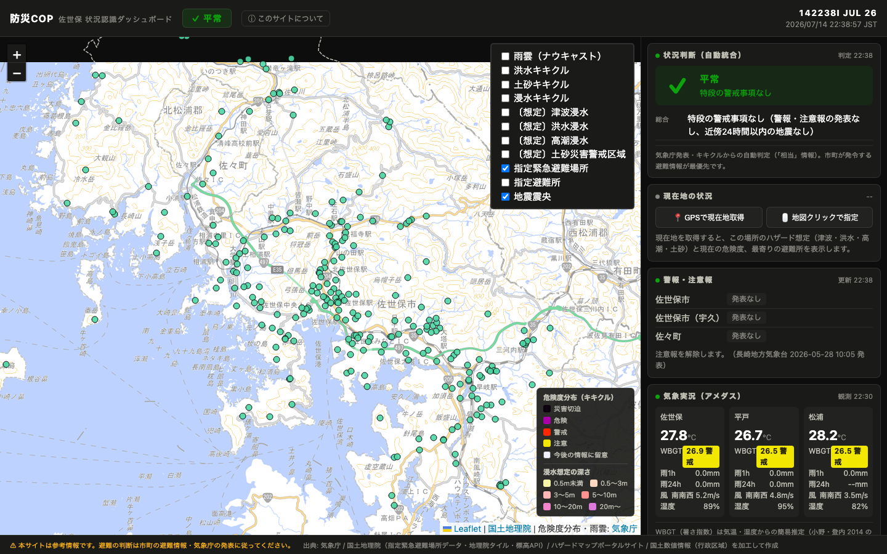
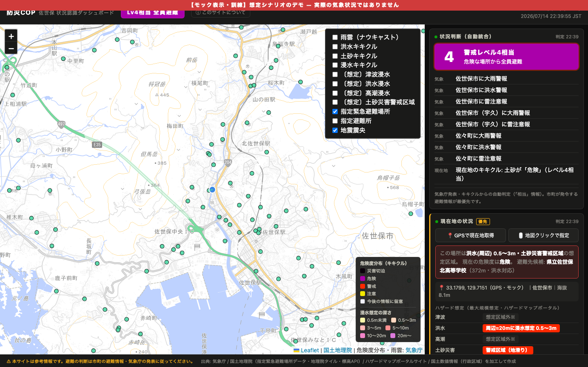

# 防災COP — 状況認識ダッシュボード

地域の防災情報（気象警報・雨雲・危険度分布・地震・ハザード想定・避難所）を**1画面に統合**した、市民向けの状況認識（Situational Awareness）ツール。

> *A single-screen disaster situational-awareness dashboard for Japanese local communities. It applies the concept of a Common Operational Picture (COP) — fusing scattered data sources into one decision-ready view — to civilian disaster preparedness. Pure vanilla JS, no build step, no API keys; all data from official Japanese government open APIs (JMA, GSI, Hazard Map Portal).*



---

## コンセプト — COP（共通状況図）の考え方を防災へ

災害時の情報は、気象庁・国土地理院・自治体などに**分散して存在する**。個々の情報は正確でも、それらを人間が頭の中で統合して初めて「自分は今どうすべきか」が決まる。この統合作業を、緊迫した状況下の一般市民に強いるのは酷である。

危機管理の分野には、この課題に対する古典的な解がある。**COP（Common Operational Picture／共通状況図）** — バラバラな情報源を1枚の図に統合し、判断を速くするという考え方である。本ツールはその発想を防災に転用したもので、以下の原則を設計に落とし込んでいる。

| 原則 | 本ツールでの実装 |
|---|---|
| **情報の統合** | 気象庁・国土地理院・ハザードマップポータルに分散する7系統の情報を1画面に集約 |
| **判断の根拠を示す** | 総合レベルを自動判定するだけでなく、**そう判定した根拠を列挙**する（結論だけ出さない） |
| **情報の鮮度管理** | 全パネルに更新時刻と鮮度インジケータ。古い情報で判断させない |
| **静的評価と現況の重畳** | ハザード想定（＝その土地が本来持つ危険性）と、キキクル（＝今まさに起きている危険）を同一地点で併記 |
| **不明を不明と報告する** | 通信失敗時に「区域外（＝安全）」と誤報せず「**判定できず**」と明示する |

## 災害時の画面

大雨警報・洪水警報が発表され、現在地の土砂キキクルが「危険」になった状況（訓練モック）。
状況が動くとパネルが**自動で並び替わり**（危険度の高い情報が上へ）、総合レベルは国の警戒レベル体系に沿って**レベル4相当（紫）＝全員避難**を表示する。



## 機能

| パネル | 内容 | ソース | 更新 |
|---|---|---|---|
| 地図（COP主画面） | 避難所435件・雨雲ナウキャスト・キキクル（洪水/土砂/浸水）・ハザード想定・地震震央・行政界 | 地理院タイル＋気象庁タイル | 5分 |
| 状況判断 | 警報・現在地キキクル・近傍地震・熱中症を統合し、**国の警戒レベル相当**（5段階・公式配色）を根拠つきで判定 | 自動演算 | 連動 |
| 現在地の状況 | GPSまたは地図クリックで地点指定 → 標高・所属市町・**ハザード想定**（津波/洪水/高潮/土砂）・**現在の危険度**・最寄り避難所5件 | 標高API＋ハザードマップポータル＋気象庁 | 指定時 |
| 警報・注意報 | 市町単位の発表状況（気象庁公式配色）。**発表中の警報に対応した避難所を1タップで絞り込み** | 気象庁 | 5分 |
| 気象実況 | アメダス3地点（気温/**WBGT暑さ指数**/雨量/風/湿度） | 気象庁 | 10分 |
| 天気予報 | 今日明日の天気・気温・降水確率（6時間ごと） | 気象庁 | 30分 |
| 地震 | 直近の地震（近傍はハイライト、震央を地図にプロット） | 気象庁 | 5分 |

### 総合レベルの判定基準

気象庁・内閣府が定める「警戒レベル」との公式な対応関係に準拠した「**相当**」情報として提示する（市町が発令する避難情報が常に最優先）。

| 入力 | 総合レベル |
|---|---|
| 注意報 / キキクル「注意」 | レベル2相当（黄） |
| 警報 / キキクル「警戒」/ 震度4 / WBGT33以上 | レベル3相当（赤）— 高齢者等避難 |
| **現在地のキキクル「危険」** / 震度5弱以上 | レベル4相当（紫）— 全員避難 |
| 特別警報 / キキクル「災害切迫」 | レベル5相当（黒）— 緊急安全確保 |

## アーキテクチャ

```
ブラウザ（静的HTML + vanilla JS + Leaflet 1.9.4）※フレームワーク・ビルド・APIキー不要
 ├─ 気象庁 bosai API（CORS開放済み）… 警報 / 予報 / アメダス / 地震
 ├─ 気象庁 jmatile … 雨雲ナウキャスト・キキクルのPNGタイル
 ├─ ハザードマップポータル … 津波・洪水・高潮の浸水想定、土砂災害警戒区域のPNGタイル
 ├─ 国土地理院 … 地理院タイル（淡色地図）・標高API
 └─ ローカル静的データ data/*.geojson … 避難所435件・行政界（出典: data/SOURCES.md）
```

**設計判断**: サーバーもフレームワークも持たない。理由は、防災ツールにとって最大のリスクは「災害当日に自分のインフラが落ちること」であり、依存を国の公式APIだけに絞るほうが可用性が高いと判断したため。副次的に、静的ホスティングだけで全国どこでも配れる。

**ハザード判定の仕組み**: 公開されているハザードマップのPNGタイルを取得し、現在地に対応するピクセルの色を凡例色と照合して浸水想定深を判定する。想定区域の帯は幅数ピクセルしかない場合があるため、**周辺±8px（約20m）も走査して安全側に倒す**。色の照合許容幅は、地図の背景色を「浸水想定あり」と誤認しないようテストで検証済み。

## 実行方法

**最も簡単な方法**: [`dist/bousai-cop.html`](dist/bousai-cop.html) をダブルクリックしてブラウザで開く。CSS・JS・地図ライブラリ・避難所データをすべて1ファイルに埋め込んであるためサーバー不要。

開発時:

```bash
npm start          # http://localhost:8745 （python3 -m http.server）
npm test           # 判定ロジックのテスト（node:test、13件）
npm run build      # dist/bousai-cop.html を再生成
```

## テスト

判定ロジックの純関数に対してテストを書いている（`npm test`）。DOM依存部分ではなく、**間違えると人命に関わる箇所**を選んで検証している：

- **WBGT推定式**の係数と環境省5区分の境界値
- **ハザードタイルの色照合** — 特に「地図の背景色を浸水想定と誤認しないこと」（実際にこのテストで、白が「浸水想定0.5〜3m」に誤分類されるバグを発見・修正した）
- **地震座標のパース**（不正入力で画面を落とさない）
- **距離計算**（最寄り避難所の順位付け）

## セキュリティ

公開にあたり、2つのAI（Claude / Codex）で独立にセキュリティ監査を実施し、指摘を反映している。
外部データのエスケープ方針、Leaflet の CVE-2025-69993 への対処、プライバシー、
公的APIへの負荷配慮、フェイルセーフ設計は [SECURITY.md](SECURITY.md) を参照。

## 既知の限界

防災情報を扱う以上、できないことを明示しておく。

- **プッシュ通知はない。** 就寝中の警報を知る用途には「特務機関NERV防災」等の専用アプリを併用すること。本ツールは「通知を受けた後に開いて状況を判断する画面」と位置づけている。
- **「区域外」は安全の保証ではない。** 公表されたハザードマップ上の判定にすぎず、想定を超える災害は起こりうる。
- **避難所は「指定」であり「開設」ではない。** 実際の開設状況は市町の発表で確認が必要。データも静的スナップショット（2026-07-14取得）。
- **WBGTは簡易推定。** 気温・湿度のみを用いる式のため、日射・風を考慮せず炎天下では過小評価になる（テストで明示的に検証している）。公式値は環境省のサイトを参照。
- **オフラインでは動かない。** PWA化とキャッシュは今後の課題。

## 対象地域について

同梱している設定・避難所データは、**サンプル地域として長崎県佐世保市**（および隣接する北松浦郡佐々町）を対象にしている（避難所435件）。実装を確認・評価するための参照実装であり、下記のとおり設定ファイルの書き換えだけで任意の地域に移植できる。

## 別地域への移植

`js/config.js` の予報区コード・市町村コード・アメダス観測点・地図中心を書き換えるだけで動く（コードは https://www.jma.go.jp/bosai/common/const/area.json で調べられる）。GPSを起点に全国どこでも動作させる設計への拡張も検証済み（逆ジオコーダ＋全国避難所タイルを使用）。

## 出典・ライセンス

- 気象データ・危険度分布（キキクル）・雨雲・地震: 気象庁
- 浸水想定・土砂災害警戒区域: ハザードマップポータルサイト（国土交通省）
- 避難所データ・地図タイル・標高API: 国土地理院（詳細は [data/SOURCES.md](data/SOURCES.md)）
- 行政界: 「国土数値情報（行政区域データ）」（国土交通省）を加工して作成
- WBGT推定式: 小野・登内 (2014) 日本生気象学会雑誌
- 地図ライブラリ: [Leaflet](https://leafletjs.com/) v1.9.4 (BSD-2-Clause)

## 免責

本サイトは参考情報です。**避難の判断は市町の避難情報・気象庁の発表に従ってください。**
